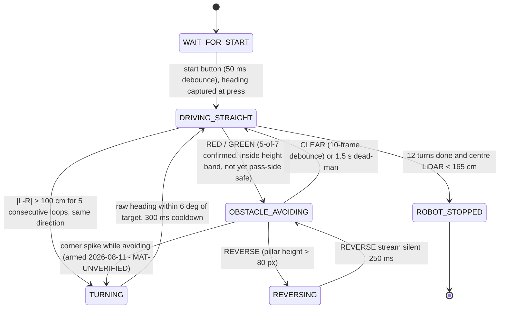

# 3 — Software Architecture & Obstacle Strategy

> **Status (2026-08-24).** The Round 2 configuration flashed at Nationals is
> [`src/Round 2/competition/`](../src/Round%202/competition/) — PID heading hold with a
> staged PAUSE→PASS→SIDE→YAW-BACK pass on the ESP32 (`test.cpp`), and a 2-class
> green/red ONNX detector with a 5-of-7 vote and 7-column offset LUT on the Pi
> (`detecttor.py`); see that folder's README and the Engineering Journal §08.
> The pipeline described below is the documented evolution that produced it and
> is retained as engineering history.

Two processors, one rule: **motion must never wait on perception.**

| Processor | Runs | Rate | Fails how |
|---|---|---|---|
| ESP32 | heading hold, corner detection, servo steering | ~50 Hz nominal (unmeasured) | If it stops, the vehicle stops |
| Raspberry Pi 5 | pillar detection, pass-side decision | vision-rate, unmeasured on Pi | If it stops, the vehicle keeps driving on its last heading target |

The split is deliberate. A detector stall on the Pi degrades the run to an Open
Challenge lap rather than ending it. Nothing in the steering loop blocks on a
vision result; the pass-side decision is an input the loop reads when present and
ignores when absent.

---

## 1. Open Challenge — implemented

`src/Round 1/round 1/round 1.ino`

1. On startup the current BNO055 Euler yaw is captured as the **target heading**.
2. `steerToHeading()` nulls the error between current and target heading, wrapped
   to +/-180 deg, and drives the servo proportionally: `STEER_GAIN = 1.0`
   servo-degree per degree of heading error with a 2.0 deg deadband, clamped to
   the asymmetric 64-136 window about the 106 centre (retuned 2026-08-10,
   `58adb1c`; was 1.5 gain / 45-135).
3. **Corner detection** is a rising-edge test, not a threshold test: a corner is
   declared when a side TF-Luna transitions from "wall present" to reading
   **> 150 cm** (`OPENING_CM`). The target heading is then stepped by 90 deg
   toward the opening.

**Why an edge and not a level.** A level test re-fires on every loop iteration
while the opening is still in view, stepping the heading by 90 deg repeatedly and
spinning the vehicle. The edge test fires once per opening.

**Why absolute heading rather than integrated turn rate.** The BNO055 supplies a
fused absolute yaw. A gyro-integrated heading accumulates drift over three laps
and there is no landmark in the Open Challenge to correct against.

---

## 2. Obstacle Challenge — implemented

**Status: landed.** Controller (`src/Round 2/main.cpp`) and Pi runtime
(`src/Round 2/round2.py`) are in this repository. The three integration fixes
that gated the landing are done: the wireless telemetry link is compiled out
behind `ENABLE_BLUETOOTH 0` for rule 11.10 compliance, the BNO055 sits on
verified multiplexer channel 4, and the TB6612 standby line is driven high
unconditionally. The state machine below documents the controller **as
committed** in `src/Round 2/` — not as resident on the vehicle. What is
physically on the ESP32 is whatever was flashed last, which this repository
does not track, so a flash of the committed build precedes any run and the run
log records the revision flashed.

### The serial protocol, and why it is state-gated

The Pi speaks five messages at 115200 baud: `RED`, `GREEN`, `CLEAR`, `REVERSE`,
and `POS,cx,h` (Kalman-smoothed pillar centre-x and height, every tracked
frame). The active colour is re-sent every 0.5 s as a keepalive; the controller
auto-clears after 1.5 s of silence, so a dead link degrades to heading-hold
instead of a runaway swerve.

Commands are honoured only where they are safe. `RED`/`GREEN` are accepted
while driving straight **or already avoiding** — a mid-avoid colour switch must
flip the swerve, a failure we hit in testing. Everything is ignored during
`TURNING` (a corner is never aborted halfway) and after `ROBOT_STOPPED` (a
stray post-finish detection must never restart the vehicle, rule 9.24).

### Why this shape

- **`DRIVING_STRAIGHT` is the default and every other state returns to it.**
  Any state that cannot make progress falls back to PD heading-hold, which is
  the behaviour that scores worst-case rather than crashes.
- **Avoidance is a gradient, with the field-proven full lock as its boundary.**
  The steer offset is proportional to how far the pillar sits from its
  pass-side safe line in the frame (`offset = KV * error`, floored at a small
  minimum while error remains, clamped to the +/-35 mechanical envelope). Large
  error saturates to exactly the old binary full-lock swerve, which also
  remains the fallback until the first `POS` of each pillar arrives. Field
  evidence is never thrown away — it becomes the clamp.
- **Detection is gated by voting, not by a confidence score.** The calibrated-Lab
  picker has no confidence scalar; a colour must appear in 5 of the last 7
  frames, inside the height band, and short of its pass-side line before a
  command is sent. Holding course remains the safe default.
- **Heading is captured at the start button, not at boot** — with the vehicle
  placed on the mat, so the reference frame is the field. The BNO055 runs in
  IMUPLUS mode (no magnetometer: drive-motor magnets cannot distort yaw), and
  each turn target is stepped +/-90 deg **from the previous target**, so the
  four leg headings stay exactly orthogonal in any reference frame and drift
  cannot accumulate across twelve turns.
- **Corner spikes must persist.** A pillar occluding one side LiDAR can fake the
  left-right asymmetry for a frame or two; requiring 5 consecutive
  same-direction loops rejects it. Turn completion is checked on the raw
  heading — the smoothing filter's ~200 ms lag would overshoot every corner.

### Designed, not yet implemented

**Parking is confirmed in-scope (decided 2026-08-06)** — `PARK_SEARCH` /
`PARALLEL_PARK` states are a commitment, not an option, but they are not in
the committed controller yet. The scoring
table settles it: rule 1.8.3 pays 7 points even for a partial or non-parallel
park, so a crude, conservative attempt strictly dominates a descope (full
rationale: [4 — Decisions](4_systems_and_decisions.md), D7). One of the two
constraints has since been removed: bay **detection** exists — the runtime
picker gained a third calibrated magenta class on 2026-08-12 (§3.1) and
reports bay sightings as telemetry. What is missing is the controller that
acts on them: no state consumes `MAG` and the park states do not exist in
code. The second constraint stands — rule 9.24.7 ends the round on touching a
limiter, which caps how aggressive the manoeuvre may be.

Parking-bay entry geometry, and the tuned value of the gradient gain `KV` —
both wait on the new chassis dimensions and mat time (see
[1 — Mobility](1_mobility.md)).

---

## 3. Detection stack

**Stack of record (2026-08-05): calibrated-Lab colour picker.** One (a,b) chroma
disc per colour in CIELab, sampled interactively at the venue (median + MAD sets
the tolerance, capped), with an L floor and a chroma gate; largest connected
component with extent and aspect gates; 5-of-7 temporal vote; nearest pillar by
lowest box bottom edge. Per-venue calibration is a deliberate reversal of the
fixed published-value-band philosophy — reasoning in
[D6](4_systems_and_decisions.md#d6--neural-detector-superseded-in-the-field-calibrated-per-venue-picker-adopted).
The runtime is landed at `src/Round 2/round2.py` alongside the controller.

*Bench test on the Raspberry Pi 5 against physical pillars: dual-pillar frame
classified with per-colour boxes. The overlay's fps and per-frame-ms figures
will be quoted in the metrics section once pinned to the exact build under
test.*

**Superseded (kept as evidence):** `nanodet_lite`, 1,167,660 parameters, 4.52 MB
ONNX — won the val split but did not transfer to real footage. Full write-up and
reproduction steps: [`src/Round 2/detector/README.md`](../src/Round%202/detector/README.md);
selection evidence vs `tiny_pillar`:
[4 — Systems Thinking](4_systems_and_decisions.md#d2--tiny_pillar-111-k-params-rejected-in-favour-of-nanodet_lite-117-m-params).

---

### 3.1 Third class: magenta parking-lot markers (2026-08-12)

The runtime picker calibrates three classes, not two. Magenta was previously
excluded on purpose — as a distractor to veto, since the rules put magenta only
on the parking-lot limitation blocks (200 × 20 × 100 mm, RGB 255, 0, 255) and
nothing in the controller scored for them. Parking is in scope, so magenta is
now calibrated exactly like red and green, on calibration key `3`.

The gates below are magenta-only. The red/green path is unchanged and was
verified bit-identical after the change.

| Gate | Value | Why |
|---|---|---|
| Hard pre-gate | `b* < 126` in u8 Lab (`b* < 0` signed) | magenta is the only one of the three classes with negative `b*` — the mirror of the red `b* > 0` gate |
| Chroma floor | 32 (default 10) | at close range a low-chroma magenta reflection-bleed field on the glossy mat merges with the marker into one large, low-extent blob. The bleed, not the hue, was the failure |
| Morphology | `OPEN` 3 × 3 | severs the bleed from the marker. A `CLOSE` was tried first and falsified — it bridges the bleed *into* the marker |
| Blob selection | extent ≥ 0.40, top-3 candidates, aspect ≤ 8 | two strips per lot, plus edge clipping, mean the largest blob is often not the usable one |
| Calibration tolerance | `max_tol` 22 | the 15 cap exists to keep the red↔green budget apart; magenta's nearest neighbour is far outside it (§4.2) |

The Pi emits `MAG,cx,h,w` at 5 Hz after a 5-of-N confirmation. Width is
appended **last**, so a parser reading the earlier two-field form stays
correct. The ESP32 stores the width and drives no behaviour from it.

---

## 4. Metrics used to validate performance

All figures on the leakage-free group-wise validation split (124 real images).
They belong to the superseded neural stack and are retained as selection
evidence; the *method* — the sweep, asymmetric error costs, failure
decomposition — carries over to the current stack, whose own figures are in
§4.1 below. Raw output for every table in this document is committed under
`docs/eval_raw/`.

### 4.1 The picker's own figures (current stack of record)

Measured 2026-08-08 by `src/Round 2/eval_picker.py`, which imports the detection
functions from `round2.py` **verbatim** — no reimplementation, so what is
measured is the code that runs on the robot. Calibration is fitted with the
shipped `calibrate_color()` on the **train** split only; the val images below
were never used to fit it. Raw: `docs/eval_raw/picker_eval_summary.txt`.

| | pooled calibration | condition-matched calibration |
|---|---|---|
| Detection rate (nearest pillar) | 68.5 % | 63.3 % stills · 100 % video |
| Colour correct, given a detection | 76.5 % | **90.3 %** stills · 80.8 % video |
| Pass-side calls committed | 33.1 % (41/124) | 33.7 % stills · 38.5 % video |
| **Accuracy among committed calls** | 90.2 % (37/41) | **100 % (33/33)** stills · 90.0 % (9/10) video |
| **Wrong-side rate** | 3.2 % | **0.0 %** stills · 3.8 % video |
| Hold course (pillar under the 45 px gate) | 50.8 % | 50.0 % · 23.1 % |
| False detections per empty frame | 0.35 (21/60) | — |
| Latency, 240×240 | 4.6 ms median (desktop, **not a Pi figure**) | — |

**The finding, and it changed race procedure.** Pooling calibration samples
across two acquisition sessions drives red's tolerance to exactly 15.00 — the
`max_tol` ceiling — because the two sessions disagree about what red *is*: their
fitted red centres sit **24.0 apart** in Lab (a,b) (stills a=29.9 b=23.5; video
a=48.5 b=38.7) while the tolerance is only 12–15. One circle cannot cover both,
so the pooled fit lands between them and clips both. Calibrating within a single
condition removes the wrong-side calls entirely on the stills family (0 wrong in
33 committed calls) and lifts colour accuracy 76.5 % → 90.3 %.

This is the measured form of the field failure we recorded on 2026-08-06
("detector fails on slight colour shift"). It is not a defect to be tuned away —
it is a property of thresholding raw colour, and the procedural answer is to
calibrate **at the venue, in the venue's light**, and never reuse a calibration
across lighting. That is what `--calib` JSON persistence exists for: calibrate
once during check time, then run headless from the saved file.

**Honest limits of this table.** The dataset was shot on a different camera than
the robot's, so these numbers validate the *method*, not venue performance.
Still images cannot exercise the 5-of-7 temporal vote, so the false-alarm figure
is per-frame and is therefore an upper bound on what the runtime does. The
co-occurrence arm is the weakest result — 47.1 % among committed calls (8 right,
9 wrong out of 60 composited frames), i.e. a coin flip when two pillars are
visible; those frames are composited rather than photographed, but the direction
matches the known dominant failure and it is why the mid-avoid colour-switch fix
was made a blocker rather than a nicety. Set against that,
[`other/bench-2026-08-05/bench-5.jpeg`](../other/bench-2026-08-05/bench-5.jpeg)
shows the runtime resolving a real red and a real green pillar simultaneously and
correctly on the deployed camera — one frame, so it settles nothing, but it is
reason to treat the composited proxy as pessimistic and to re-measure against
real two-pillar footage.

**Two limits this measurement exposed, both now on the record.** The 4.6 ms is
the hand-rolled NumPy Lab conversion in `round2.py`; `pillar_fast.py` does the
same conversion through `cv2.cvtColor` in 0.43 ms. On Pi-class hardware that
difference decides whether the loop clears 30 fps, and it is the first
optimisation to make if the field run is frame-starved. Second, 50.8 % of val
frames sit below the 45 px swerve gate — the gate is doing most of the work in
this dataset, so the detection numbers above describe a harder regime than the
close-range decisions that actually score.

### Confidence-threshold sweep

Superseded stack. Raw: `docs/eval_raw/nanodet_sweep_raw.txt`.

| thr | val acc | wrong side | no call | both-pillar wrong | false det / empty frame |
|---|---|---|---|---|---|
| 0.30 | 0.941 | 5.9 % | 0.0 % | 11.7 % | 0.350 |
| 0.35 | 0.932 | 5.9 % | 0.8 % | 13.3 % | 0.283 |
| **0.45** | **0.941** | **5.1 %** | 0.8 % | 18.3 % | **0.083** |
| 0.55 | 0.856 | **0.0 %** | 14.4 % | 20.0 % | 0.050 |

### Operating point: 0.45, and why

Chosen from the sweep, not by eye. Three reasons, in order:

1. **Joint-best on real-frame accuracy.** 0.30 and 0.45 tie at 0.941; nothing
   higher exists in the sweep.
2. **It cuts phantom detections on empty frames 3.4x versus 0.35** (0.083 vs
   0.283 per frame) and 4.2x versus 0.30. Most frames on a lap contain no pillar
   at all, so the empty-frame false-alarm rate is weighted more heavily than its
   column position suggests.
3. **Where it loses, it loses on synthetic data.** 0.45 is worse than 0.35 on the
   both-pillar column (18.3 % vs 13.3 %) — but that column is measured on
   **composited** frames, while the columns it wins on are measured on real ones.
   A real measurement outranks a synthetic one.

**When we would move it.** `thr 0.55` gives **zero** wrong-side calls on real
frames, at the cost of holding course 14.4 % of the time. If venue testing shows
that a spurious steer is more expensive than hesitation — for instance if the
vehicle cannot recover its line after a wrong pass — 0.55 is the switch, and it
is a one-line change.

### Failure decomposition

Where the remaining error actually lives:

| Stage | Share |
|---|---|
| Detection — nearest pillar never proposed | **30.0 %** |
| Selection — wrong pillar chosen as nearest | 1.7 % |
| Classification — right pillar, wrong colour | **0.0 %** |

This decomposition is what killed the HSV-rescoring proposal
([D3](4_systems_and_decisions.md#d3--hsv-confidence-rescoring-researched-quantified-rejected)):
colour is already solved, so a colour-based fix has nowhere to go.

---

### 4.2 Magenta class figures

85 frames sampled from two videos of the actual lot markers on the mat, run
through the full `process_frame` path rather than the mask alone. Detection at
tolerance 20: **43/85 → 76/85**.

All nine residual misses are close-approach frames in which the tape's chroma
physically collapses. That range belongs to the front TF-Luna, not the camera.
Distant and mid range are 100 %.

Measured magenta↔red separation in (a\*, b\*) is **46.8** on stills and **55.1**
on video, against tolerances of 22 for magenta and 15 for red — a cross-class
hit is not reachable. This is a different quantity from the 108.4 recorded in
`docs/eval_raw/picker_eval_summary.json`, which is the distance from the
calibrated red centre to the **published** magenta RGB; real tape is duller
than the published colour. Both figures sit far outside every tolerance in use.

The gates were set on phone footage whose auto white balance drifted (a\* 60 →
49 across 22 s), so the figures above are frame-set numbers, not mat
performance. The live, exposure- and WB-locked calibration on key `3` remains
the procedure of record for a run.

---

## 5. Edge cases

| Case | Handling |
|---|---|
| **Magenta parking walls** sit between red and green in hue and defeat a naive hue band | Not a confuser under the calibrated-Lab picker: magenta is its own calibrated class, separated from red by 46.8–55.1 in (a\*, b\*) against tolerances of 22 and 15 (§4.2). Magenta surfaces remain mined into the superseded detector's training negatives. |
| **Two same-colour pillars merge into one blob** under connected components | Nearest pillar is selected by **lowest box bottom edge**, which survives a merge better than box area or height. |
| **Distant pillars** below the `MIN_H` height gate | Deliberately ignored. A pillar too small to measure reliably is a pillar there is still time to react to on a later frame. |
| **Occluded pillar, top clipped** | Selection uses the bottom edge, not the height: clipping eats the top of a pillar while its base stays put. |
| **Both pillars in frame** | Normal on track. Nearest-by-bottom-edge decides. Worst-measured condition — see the sweep. |
| **No detection above threshold** | Hold course. Recoverable; a wrong steer is not. |
| **Mixed 4:3 and 16:9 source images** | Letterboxed, never stretched — stretching would let the model infer class from aspect ratio. |
| **Class list reordered in a config** | Pass-side lookup keyed on class **name**, not index. Loader refuses to start on a mismatch. |

---

## 6. Programming strategy history

Kept separate from mechanical history deliberately — they iterate on different
clocks and for different reasons.

| Version | What it was | Why it changed |
|---|---|---|
| HSV v1 | Hue-band threshold + contours + morphological opening | Opening dominated connected-components cost |
| HSV v4.1 | Dual classifier with startup auto-select, opening removed | 0.43 ms/frame; still the fastest thing measured |
| `tiny_pillar` | 111 K-param detector written from scratch | Abstains 9.7 % of the time; caution is not accuracy |
| `nanodet_lite` | NanoDet-Plus stripped to 45 files, no Lightning/yacs/omegaconf/pycocotools | Won the val split (six of seven metrics); **did not transfer to real footage** — single-session, zero-clutter data. Superseded 2026-08-05. |
| HSV rescoring | Proposed confidence re-weighting | Rejected on a ceiling calculation of <= 1 point |
| ROI + CNN verifier | Proposed fallback architecture | Voided: a verifier cannot recover a miss |
| YOLO26 (Ultralytics) | 9.47 M-param end-to-end detector; `s` measured ~30 fps @ 224 on the Pi 5 | Trained on the leaky split (numbers withdrawn); the smaller `n` variant failed under concurrent runtime load — suspected OOM, kernel-log capture pending |
| Calibrated-Lab picker | Per-venue interactive calibration: one (a,b) chroma disc per colour + L floor; CCL; 3-of-5 vote | **Current (base).** Fixed bands degraded under lighting / brightness variation; per-venue sampling is the reversal that survived. Sub-iterations (3-disc brightness buckets, capsule chain) tested and killed — the single disc is what passed hardware testing. Accuracy and ms/frame capture pending |
| Picker + magenta third class | Calibration key `3`, hard `b* < 126` pre-gate, chroma floor 32, `OPEN` 3 × 3, top-3 blob selection | **Current (extension, 2026-08-12).** Parking entered scope, so bay detection had to exist. Close-range reflection bleed, not hue, was the failure; `CLOSE` morphology was tried first and falsified. 43/85 → 76/85 at tolerance 20 on 85 mat frames (§4.2). Telemetry only — no controller consumes it |

Full reasoning for each in [4 — Systems Thinking & Engineering Decisions](4_systems_and_decisions.md).

---

## 7. Testing and tuning process

The metrics in §4 say what the software achieves. This section says how the
constants that produce them were arrived at, because a number chosen by eye and
a number chosen by sweep score the same on a table and are not the same
engineering.

### 7.1 The test ladder

Four stages, each one cheap enough to run often and each one able to falsify the
stage below it. Nothing moves up a stage until the stage below passes.

| Stage | What it can prove | What it cannot |
|---|---|---|
| **Host stub** — compile and run the module against a fake HAL on a desktop | Logic, state transitions, arithmetic, that a refactor did not change behaviour | Anything about timing, hardware, or the physical world |
| **Bench, wheels off ground** | Flash succeeded, motor direction, servo travel and centre, button polarity, I²C map | Anything involving traction, load, or the mat |
| **Mat run** | Corner detection, lap counting, whether the vehicle holds a line | Venue lighting, venue clutter |
| **Venue check time** | Calibration under the actual lights — the only place `calib.json` may be produced | Nothing beyond it; this is the last stage |

The ladder exists because of a specific failure: the drive module was written,
host-stub verified across all three driver topologies, and *then* found to fork
with the Round 1 sketch over a pin assignment. Host verification proved the
module correct and proved nothing about the system it was joining.

### 7.2 Where every tuned constant came from

Five sources, and they are not equally trustworthy. Anything set on the mat is a
measurement of *this* vehicle on *that* day; anything from geometry is a
prediction that survives until measured.

| Constant | Value | Set by | What would change it |
|---|---|---|---|
| `SERVO_CENTER` | 106 | **Mat** (2026-08-10) — was 90 | Re-tune after any linkage rebuild |
| Steering window | 64–136, asymmetric −42/+30 | **Mechanical limits**, measured on the linkage | Rebuild; the clamp exists so no software state can command past a stop |
| `STEER_GAIN` (R1) | 1.0 servo-deg per deg | **Mat** — was 1.5 | Oscillation at speed → lower; sluggish recovery → raise |
| `STEER_DEADBAND` | 2.0 deg | **Mat** — added to stop hunting about centre | Wider if the servo buzzes on straights |
| PD gains (R2) | Kp 1.2, Kd 0.15, 1.5 deg deadband, ±20 clamp | **Geometry + host stub — NOT yet mat-tuned** | First flashed mat session. This is the largest untuned surface in the controller |
| `DRIVE_SPEED` | 1000 (~98 % duty) | **Mat** — was 550 | ⚠ Deliberately flagged: 98 % duty leaves **no headroom**, so the vehicle slows as the pack sags. A speed-vs-completion sweep is the open experiment |
| `FINAL_RUN_MS` | 500 | **Mat** — was 1500 | Distance comment is stale at the new speed; re-derive from measured m/s |
| `OPENING_CM` | 150 cm | **Field geometry** — corridor width vs wall height | Different mat layout |
| Corner persistence | 5 consecutive same-direction loops | **Failure analysis** — a pillar occluding one side LiDAR fakes the asymmetry for 1–2 frames | More false corners → raise; missed corners → lower |
| Turn completion | raw heading within 6 deg | **Falsified the smoothed alternative** — the EMA's ~200 ms lag overshot every corner | Nothing; the smoothed form is disproven |
| Post-turn cooldown | 300 ms | **Failure analysis** — one opening must not re-trigger | — |
| `KV_VISUAL` | 0.28 (R2 v2: red 0.34 / green 0.28) | **Geometry** — deg of steer per px of error | **Untuned.** First mat session with the obstacle stack |
| `MIN_ACTIVE_SWERVE` | 8 | **Reasoning** — guarantees progress while any error remains | — |
| Pass-side lines | red x < 90, green x > 150 | **Frame geometry** + rule 9.19 side semantics | Camera re-mount |
| Height bands | 45 px far gate / 80 px too-close | **Frame geometry** | Camera re-mount |
| Temporal vote | 5 of last 7 frames | **Reasoning** — trades latency for false-alarm rejection | Measured false-alarm rate at the venue |
| `CLEAR` debounce | 10 frames | **Failure analysis** — the self-cancelling avoidance chain | — |
| Dead-man | 1.5 s | **Reasoning** — link death must degrade to heading-hold | — |
| Exposure | 50 ms | **Arithmetic, not preference** — 5 × 10 ms (50 Hz) and 6 × 8.33 ms (60 Hz), so one value is flicker-safe on either grid | Only a grid that is neither 50 nor 60 Hz |
| White balance | 4500 K, locked | **Procedure** — any auto-WB defeats a fixed chroma disc | — |
| `max_tol` | 15 red/green · 22 magenta | **Measured** — median + 1.4826 × MAD, capped | Cap keeps the red↔green budget apart; magenta's neighbour is 46.8–55.1 away (§4.2) |
| Chroma floor | 32 magenta (10 default) | **Falsified experiment** — close-range reflection bleed, not hue, was the failure | — |
| Morphology | `OPEN` 3 × 3 | **Falsified `CLOSE` first** — it bridged the bleed *into* the marker | — |
| Detector threshold | 0.45 | **Four-point sweep** (§4) — joint-best real accuracy, 3.4× fewer phantom detections than 0.35 | Switch to 0.55 if a spurious steer proves costlier than hesitation |

### 7.3 Tuning attempts that failed, and what they cost

Kept because a tuning process that only records successes is a list of settings,
not a method.

| Attempt | Result | What it taught |
|---|---|---|
| `CLOSE` morphology to clean the magenta mask | **Falsified** — bridged reflection bleed into the marker, making the blob worse | Diagnose the failure before choosing the operator; the problem was bleed, not noise |
| Three brightness-bucketed chroma discs | **Killed** — fewer detections, garbage boxes | Chroma is *non-monotonic* in brightness: shadow and glare both desaturate, so ordering colour regions by brightness is invalid |
| Brightness-ordered capsule chain | **Killed** | Same root cause as above |
| Bounded robust ellipse | **Killed** — passed synthetic tests only | Synthetic-only validation is not validation |
| Pooled multi-session calibration | **Measured as harmful** (§4.1) — drives tolerance to the 15.00 ceiling and clips both sessions | Became a *procedural* rule: calibrate at the venue, never reuse across lighting |
| HSV confidence rescoring | **Rejected on a ceiling calculation** (≤ 1 point) before implementation | Compute the best case before building; colour error was already 0.0 % |
| ROI + CNN verifier fallback | **Voided** | A verifier sits downstream of proposals — it cannot recover a detection that was never made |

### 7.4 The instrument question — resolved against video

Performance was twice measured from run video, and **both attempts failed and
were discarded rather than published**:

1. Median-background subtraction — defeated by handheld camera motion.
2. Colour segmentation with ORB homography stabilisation — locked onto stored
   red and green blocks sharing the vehicle's hue family.

A third analysis produced a plausible-looking oscillation frequency of 1.21 Hz.
It was withdrawn: two estimators disagreed by **6×** (FFT 1.21 Hz vs zero-crossing
7.5 Hz), and the 1.21 Hz "peak" turned out to be the corner frequency of the
1-second detrend window used in the analysis itself. The vehicle's ~100 px motion
against a ~4.5 px residual put the whole measurement at the noise floor.

**Conclusion, and it is now the standing rule: the instrument is serial
telemetry, not video.** The firmware prints `[turn] n/12`, `[steer] err/angle`,
`[calib]`, `[perf]` and `[stop]` every loop; `tools/serial_log.py` captures it
(`py -3 tools\serial_log.py COM5`). One logged run settles the effective loop
rate, the turn count, the run-on distance and the stop condition simultaneously —
four open questions, one artifact. Video is kept for the rule 7 demonstration
requirement and for qualitative review, not for numbers.

### 7.5 What is not yet tuned, and what gates it

Stated plainly rather than left to inference:

| Open | Gate |
|---|---|
| `KV_VISUAL` final value | First mat session with the obstacle stack flashed |
| R2 PD gains (Kp 1.2 / Kd 0.15) | Same session — currently geometry-derived only |
| Effective loop rate (~50 Hz is nominal, never measured) | One logged run; two print lines per loop and ~2 ms of I²C were never budgeted |
| `DRIVE_SPEED` vs lap-completion trade | A two-speed sweep, ~10 runs each |
| Parking bay entry geometry | The park controller, which does not exist in the committed build |

Every row above is a measurement this repository does not have. They are listed
here rather than quietly omitted, because the difference between a tuned constant
and an untuned one is exactly what a reader needs in order to judge how far the
metrics in §4 generalise.
